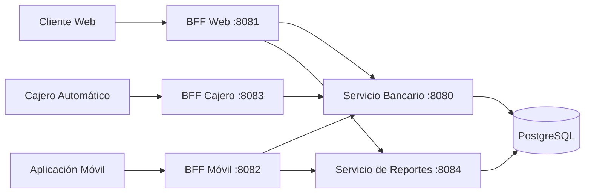

# Banco XYZ — Backend for Frontend (BFF)

Proyecto individual de **Desarrollo Backend III (PBY2203)**, desarrollado por **Alberto Agustín García**. Continúa el procesamiento batch de datos legacy del Banco XYZ e implementa un backend especializado para web, móvil y cajeros automáticos.

## Objetivo

Modernizar el acceso a los datos procesados mediante tres BFF independientes:

- **Web:** información completa, movimientos paginados y reportes agregados.
- **Móvil:** datos esenciales y un historial reducido.
- **Cajero:** consulta de saldo y retiros con seguridad adicional.

Tecnologías: Java 17, Spring Boot 3.2.5, Spring Security, Spring Batch 5, PostgreSQL 15, Maven y Docker Compose.

## 1. Estrategia BFF elegida

| Estrategia | Evaluación |
|---|---|
| Backend común con endpoints por cliente | Simplifica el inicio, pero une el despliegue y escalamiento de los canales. |
| BFF independientes | Personaliza contratos, permisos y seguridad. **Es la estrategia elegida.** |
| BFF con delegación a servicios | Centraliza reglas y agrega diferentes fuentes. Se combina con los BFF independientes. |

Cada BFF es una aplicación Spring Boot ejecutable. Las reglas de saldo y retiro están en el servicio bancario; movimientos y auditoría están en el servicio de reportes. El costo de operar cinco procesos se controla con un monorepo Maven multimódulo, contratos comunes, paginación y tiempos máximos de comunicación.

## 2. Arquitectura



Con `bff/compose.tls.yml`, todas las comunicaciones usan HTTPS. Los servicios internos no publican puertos al host y son los únicos componentes con acceso a PostgreSQL.

## 3. Estructura del proyecto

```text
bank-batch/
├── data/                         # CSV legacy
├── docker/                       # Inicialización de PostgreSQL
├── src/                          # Jobs Spring Batch
├── docker-compose.yml            # PostgreSQL
└── bff/
    ├── contratos/                # DTO comunes
    ├── soporte-bff/              # Seguridad y clientes HTTP
    ├── servicio-bancario/        # Cuentas, saldos y retiros
    ├── servicio-reportes/        # Movimientos y resúmenes
    ├── bff-web/                  # Puerto 8081
    ├── bff-movil/                # Puerto 8082
    ├── bff-cajero/               # Puerto 8083
    ├── pruebas-integracion/
    ├── scripts/
    ├── compose.yml
    └── compose.tls.yml
```

Los módulos comunes reutilizan elementos técnicos, pero cada canal conserva aplicación, controlador, contrato de salida y despliegue propios.

## 4. Autenticación y autorización

| Canal | Autenticación | Vigencia JWT | Alcance |
|---|---|---:|---|
| Web | Usuario y contraseña | 15 minutos | Panel completo de la cuenta asociada. |
| Móvil | Usuario y contraseña | 5 minutos | Resumen ligero de la cuenta asociada. |
| Cajero | Cuenta, PIN, terminal y clave | 2 minutos | Saldo y retiro. |

Cada canal firma JWT con un secreto distinto. Se validan firma, emisor, audiencia, expiración y cuenta. Un token de otro canal es rechazado. Cajero requiere además `X-ATM-Terminal` y `X-ATM-Key`; web y móvil no pueden retirar.

Credenciales locales de demostración:

- Web: `web-demo` / `WebDemo2026!`
- Móvil: `mobile-demo` / `MobileDemo2026!`
- Cajero: PIN `1234`, terminal `ATM-001`, clave `AtmTerminal2026!`

## 5. Contratos por canal

| Canal | Endpoint | Respuesta |
|---|---|---|
| Web | `GET /api/web/panel?pagina=0&tamanio=2` | Cuenta detallada, retiros, movimientos paginados y resúmenes anuales. |
| Móvil | `GET /api/movil/resumen` | Cuenta, tipo, saldo y tres movimientos resumidos. |
| Cajero | `GET /api/cajero/saldo` | Cuenta y saldo disponible. |
| Cajero | `POST /api/cajero/retiros` | Solicitud, monto, saldo restante y estado. |

Web agrega en paralelo información de ambos servicios. Móvil y cajero usan consultas y DTO reducidos. Web y móvil admiten compresión. Los clientes internos tienen tiempos máximos de conexión de 2 segundos y lectura de 5 segundos. No se almacenan saldos en caché.

## 6. Integridad de los retiros

El saldo operativo se guarda en `bff_saldo` y los comprobantes en `bff_retiro`. Un retiro valida monto, decimales, tipo de cuenta y fondos; luego actualiza saldo y comprobante en una transacción con bloqueo de fila.

`solicitudId` garantiza idempotencia: repetirlo con el mismo monto devuelve el comprobante original sin descontar nuevamente; reutilizarlo con otro monto produce conflicto. El máximo configurado es `200000.00`.

## 7. Requisitos

- Java 17 y `keytool`
- Maven 3.9+
- Docker Desktop y Docker Compose
- PowerShell 7
- Puertos `5432`, `8081`, `8082` y `8083` disponibles

## 8. Compilar y ejecutar

Desde `bank-batch`:

```powershell
docker compose up -d
docker compose ps
mvn clean verify

java -jar target\bank-batch-0.0.1-SNAPSHOT.jar --spring.batch.job.name=dailyTransactionJob
java -jar target\bank-batch-0.0.1-SNAPSHOT.jar --spring.batch.job.name=monthlyInterestJob
java -jar target\bank-batch-0.0.1-SNAPSHOT.jar --spring.batch.job.name=annualStatementJob
```

PostgreSQL usa la base `bankdb`, usuario `bankuser`, contraseña local `bankpassword` y puerto `5432`.

Selecciona una cuenta de ahorro y configura secretos independientes:

```powershell
docker compose exec db psql -U bankuser -d bankdb -c "SELECT record_key, cuenta_id, nombre, saldo_final FROM processed_account WHERE tipo='ahorro' ORDER BY cuenta_id;"

$cuenta = Read-Host "record_key de la cuenta de ahorro"
$env:BANK_WEB_IDENTITIES = [guid]::NewGuid().ToString('N') + [guid]::NewGuid().ToString('N') + '=' + $cuenta
$env:BANK_MOBILE_IDENTITIES = [guid]::NewGuid().ToString('N') + [guid]::NewGuid().ToString('N') + '=' + $cuenta
$env:BANK_ATM_IDENTITIES = [guid]::NewGuid().ToString('N') + [guid]::NewGuid().ToString('N') + '=' + $cuenta

.\bff\scripts\generar-certificados.ps1 -Keytool (Get-Command keytool).Source
docker compose --env-file bff/.tls/.env.tls -f docker-compose.yml -f bff/compose.yml -f bff/compose.tls.yml up -d --build
docker compose --env-file bff/.tls/.env.tls -f docker-compose.yml -f bff/compose.yml -f bff/compose.tls.yml ps
```

No publiques secretos, claves privadas ni la carpeta `bff/.tls`.

## 9. Ejemplos de uso

Después de cada login, usa `accessToken` como `Authorization: Bearer <token>`.

### BFF Web

```http
POST https://localhost:8081/api/web/login
{"usuario":"web-demo","clave":"WebDemo2026!"}

GET https://localhost:8081/api/web/panel?pagina=0&tamanio=2
Authorization: Bearer <token_web>
```

### BFF Móvil

```http
POST https://localhost:8082/api/movil/login
{"usuario":"mobile-demo","clave":"MobileDemo2026!"}

GET https://localhost:8082/api/movil/resumen
Authorization: Bearer <token_movil>
```

### BFF Cajero

```http
POST https://localhost:8083/api/cajero/sesion
X-ATM-Terminal: ATM-001
X-ATM-Key: AtmTerminal2026!
{"cuenta":"<record_key>","pin":"1234"}

GET https://localhost:8083/api/cajero/saldo
Authorization: Bearer <token_cajero>
X-ATM-Terminal: ATM-001
X-ATM-Key: AtmTerminal2026!

POST https://localhost:8083/api/cajero/retiros
Authorization: Bearer <token_cajero>
X-ATM-Terminal: ATM-001
X-ATM-Key: AtmTerminal2026!
{"solicitudId":"<UUID nuevo>","monto":10.00}
```

Códigos esperados: `200` operación válida, `400` datos inválidos, `401` sin autenticación o terminal incorrecto, `403` token de otro canal y `409` conflicto o saldo insuficiente.

## 10. HTTPS y certificados

Los tres BFF y los dos servicios internos usan certificados PKCS12 diferentes, RSA 2048, SHA-256 y TLS 1.2/1.3. La carpeta `bff/.tls` está excluida de Git porque contiene claves privadas.

Para validar HTTPS sin desactivar la comprobación del certificado:

```powershell
.\bff\scripts\verificar-https.ps1 -Docker (Get-Command docker).Source
```

El script comprueba HTTPS, certificado, token obligatorio, contraseña incorrecta, aislamiento móvil-web y terminal ATM incorrecto.

## 11. Pruebas automatizadas

```powershell
mvn -B -f bff/pom.xml verify
```

Las **15 pruebas de integración** verifican contratos, autenticación, autorización, saldo compartido, validaciones, idempotencia, concurrencia y rollback. Usan H2 por defecto. Para probar PostgreSQL en un esquema temporal:

```powershell
$env:BFF_TEST_POSTGRES = 'true'
mvn -B -f bff/pom.xml verify
Remove-Item Env:BFF_TEST_POSTGRES
```

Las pruebas automatizadas usan HTTP y tokens de prueba; HTTPS y JWT se comprueban adicionalmente con el script anterior.

## Fuentes académicas

- Material de las semanas 4 y 5 del AVA Duoc UC, PBY2203.
- Instrucciones específicas y pauta de evaluación sumativa de la Semana 5.
- Datos legacy del repositorio [Banco XYZ](https://github.com/KariVillagran/bank_legacy_data).
